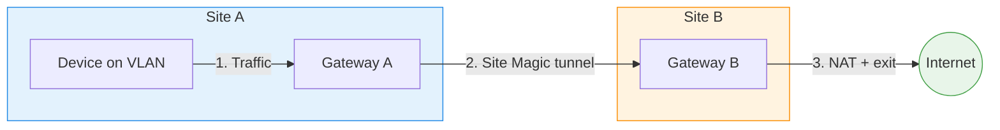

# UniFi Site Magic MSS Clamping Fix

Workaround for a UniFi firmware bug where TCP MSS clamping rules are missing for Site Magic (SD-WAN) tunnel interfaces (`wgsts1000`).

## Use Case

You have two UniFi sites connected via Site Magic (SD-WAN), and you want devices on a VLAN at Site A to use Site B's internet connection — for example, to appear with a different public IP or to access geo-restricted content.



This is achieved by:
1. Creating a VLAN at Site A for the devices you want to route
2. Including that VLAN in the Site Magic mesh
3. Creating a Traffic Route (Policy-Based Route) that sends traffic from the VLAN through the Site Magic tunnel to Site B
4. Site B NATs the traffic and sends it out its own WAN

## DNS Configuration

When using a Traffic Route through Site Magic, you **must** set custom DNS servers on the VLAN's DHCP settings (e.g., `1.1.1.1` and `8.8.8.8`). Without this, DNS queries from devices on the VLAN will fail.

This happens because the gateway creates a separate DNS resolver instance for PBR traffic, but that instance has no upstream DNS servers configured. Setting DNS explicitly on the VLAN bypasses this resolver entirely.

## The MSS Clamping Bug

UniFi automatically adds TCP MSS clamping rules for `wgclt1` and `wgsrv1` interfaces, but **not** for `wgsts1000` (Site Magic). Without MSS clamping, TCP connections negotiate a packet size based on the 1500 MTU LAN interface, but the Site Magic tunnel has a 1420 MTU. This causes:

- Large TCP packets to exceed the tunnel MTU, resulting in fragmentation failures
- Degraded performance for web browsing and downloads
- Speed tests (e.g., fast.com) failing entirely

## The Fix

A small idempotent script that adds the missing MSS clamping rules to the `UBIOS_FORWARD_TCPMSS` mangle chain. It checks before adding and exits cleanly if the chain or interface doesn't exist yet.

## Files

| File | Install location | Purpose |
|---|---|---|
| `fix-mss-clamping.sh` | `/data/fix-mss-clamping.sh` | The fix script (idempotent) |
| `fix-mss-clamping.service` | `/etc/systemd/system/fix-mss-clamping.service` | Runs at boot after network is up |
| `fix-mss-clamping.cron` | `/etc/cron.d/fix-mss-clamping` | Runs every 5 min to catch reprovisioning |
| `deploy.sh` | — | Deploys to a gateway via SSH |

## Installation

Install on **both** Site Magic endpoints (both gateways in the SD-WAN mesh).

```bash
./deploy.sh <hostname>
```

For example:
```bash
./deploy.sh udm
./deploy.sh udr7
```

Or manually:
```bash
# Copy the script
scp fix-mss-clamping.sh <hostname>:/data/fix-mss-clamping.sh
ssh <hostname> chmod +x /data/fix-mss-clamping.sh

# Install the systemd service (runs at boot)
scp fix-mss-clamping.service <hostname>:/etc/systemd/system/
ssh <hostname> "systemctl daemon-reload && systemctl enable fix-mss-clamping.service"

# Install the cron job (catches reprovisioning)
scp fix-mss-clamping.cron <hostname>:/etc/cron.d/fix-mss-clamping

# Run it now
ssh <hostname> /data/fix-mss-clamping.sh
```

## Persistence

On UniFi OS 5.x, the root filesystem is an overlayfs with a persistent read-write upper layer (`/mnt/.rwfs/data`). This means:

- `/data/` — persists across reboots and firmware upgrades
- `/etc/systemd/system/` — persists (overlayfs upper layer)
- `/etc/cron.d/` — persists (overlayfs upper layer)

## Why both systemd and cron?

- **systemd service**: Handles boot (runs after `network-online.target` with retry on failure)
- **cron job**: Handles reprovisioning — when you change network settings in the UniFi UI, the gateway rebuilds all iptables chains, wiping custom rules. The cron restores them within 5 minutes.

## Tested on

- UniFi Dream Machine (UDM) — firmware 5.0.16
- UniFi Dream Router 7 (UDR7) — firmware 5.0.16
