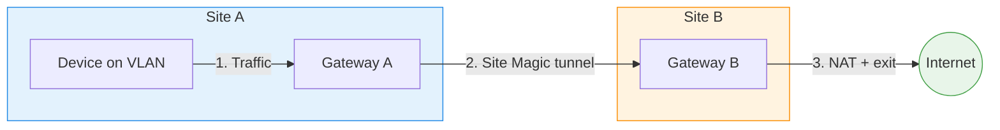

# UniFi Site Magic Fixes

Workarounds for two UniFi firmware bugs that affect Site Magic (SD-WAN) tunnel interfaces (`wgsts1000`):

1. **Missing TCP MSS clamping** — tunnels MTU is 1420 but no clamping is installed, so large TCP packets fail
2. **Empty per-route DNS resolver** — Traffic Routes through Site Magic spawn a dedicated dnsmasq instance with no upstream nameservers, so DNS returns `REFUSED` for all routed clients

Both are fixed by a single idempotent shell script run at boot (systemd) and every 5 minutes (cron, to recover from controller reprovisioning).

## Use Case

You have two UniFi sites connected via Site Magic (SD-WAN), and you want devices on a VLAN at Site A to use Site B's internet connection — for example, to appear with a different public IP or to access geo-restricted content.



This is achieved by:
1. Creating a VLAN at Site A for the devices you want to route
2. Including that VLAN in the Site Magic mesh
3. Creating a Traffic Route (Policy-Based Route) that sends traffic from the VLAN through the Site Magic tunnel to Site B
4. Site B NATs the traffic and sends it out its own WAN

## Bug 1: MSS clamping

UniFi automatically adds TCP MSS clamping rules for `wgclt1` and `wgsrv1` interfaces, but **not** for `wgsts1000` (Site Magic). Without MSS clamping, TCP connections negotiate a packet size based on the 1500 MTU LAN interface, but the Site Magic tunnel has a 1420 MTU. This causes:

- Large TCP packets to exceed the tunnel MTU, resulting in fragmentation failures
- Degraded performance for web browsing and downloads
- Speed tests (e.g., fast.com) failing entirely

**Fix:** add the missing MSS clamping rules to the `UBIOS_FORWARD_TCPMSS` mangle chain (both directions) on `wgsts1000`.

## Bug 2: Empty per-route DNS resolver

When a Traffic Route targets a Site Magic tunnel, `ubios-udapi-server` spawns a dedicated dnsmasq instance on port 20178 and installs an iptables REDIRECT that hijacks the routed clients' DNS queries to it. But the resolv-file it depends on — `/run/resolv.conf.d/wgsts1000` — is generated with **no `nameserver` lines**, so every query is answered with `REFUSED / EDE 14 (Not Ready)`.

There is no UI option (on the Route, on the Site Magic tunnel, or in the Policy Table) to populate those upstream resolvers. Symptom for end users: routed clients have working IP connectivity but no DNS, so apps fail to load.

**Fix:** when the resolv-file exists but has no `nameserver` lines, append `1.1.1.1` and `8.8.8.8` and HUP the dnsmasq instance. If a future UniFi release populates the file properly, the fix self-skips.

## Files

| File | Install location | Purpose |
|---|---|---|
| `fix-site-magic.sh` | `/data/fix-site-magic.sh` | The fix script (idempotent, covers both bugs) |
| `fix-site-magic.service` | `/etc/systemd/system/fix-site-magic.service` | Runs at boot after network is up |
| `fix-site-magic.cron` | `/etc/cron.d/fix-site-magic` | Runs every 5 min to catch reprovisioning |
| `deploy.sh` | — | Deploys to a gateway via SSH |

## Installation

Install on **both** Site Magic endpoints (both gateways in the SD-WAN mesh).

```bash
./deploy.sh <hostname>
```

For example:
```bash
./deploy.sh udm
./deploy.sh udr7
```

`deploy.sh` also removes any older `fix-mss-clamping.*` files from a previous version of this repo.

Or manually:
```bash
# Copy the script
scp fix-site-magic.sh <hostname>:/data/fix-site-magic.sh
ssh <hostname> chmod +x /data/fix-site-magic.sh

# Install the systemd service (runs at boot)
scp fix-site-magic.service <hostname>:/etc/systemd/system/
ssh <hostname> "systemctl daemon-reload && systemctl enable fix-site-magic.service"

# Install the cron job (catches reprovisioning)
scp fix-site-magic.cron <hostname>:/etc/cron.d/fix-site-magic

# Run it now
ssh <hostname> /data/fix-site-magic.sh
```

## Persistence

On UniFi OS 5.x, the root filesystem is an overlayfs with a persistent read-write upper layer (`/mnt/.rwfs/data`). This means:

- `/data/` — persists across reboots and firmware upgrades
- `/etc/systemd/system/` — persists (overlayfs upper layer)
- `/etc/cron.d/` — persists (overlayfs upper layer)

## Why both systemd and cron?

- **systemd service**: Handles boot (runs after `network-online.target` with retry on failure)
- **cron job**: Handles reprovisioning — when you change network settings in the UniFi UI, the gateway rebuilds all iptables chains and regenerates `/run/resolv.conf.d/*`, wiping our customizations. The cron restores them within 5 minutes.

## Tested on

- UniFi Dream Machine Pro Max (UDM) — firmware 5.1.12, UniFi Network 10.3.58
- UniFi Dream Router 7 (UDR7) — Site Magic peer
